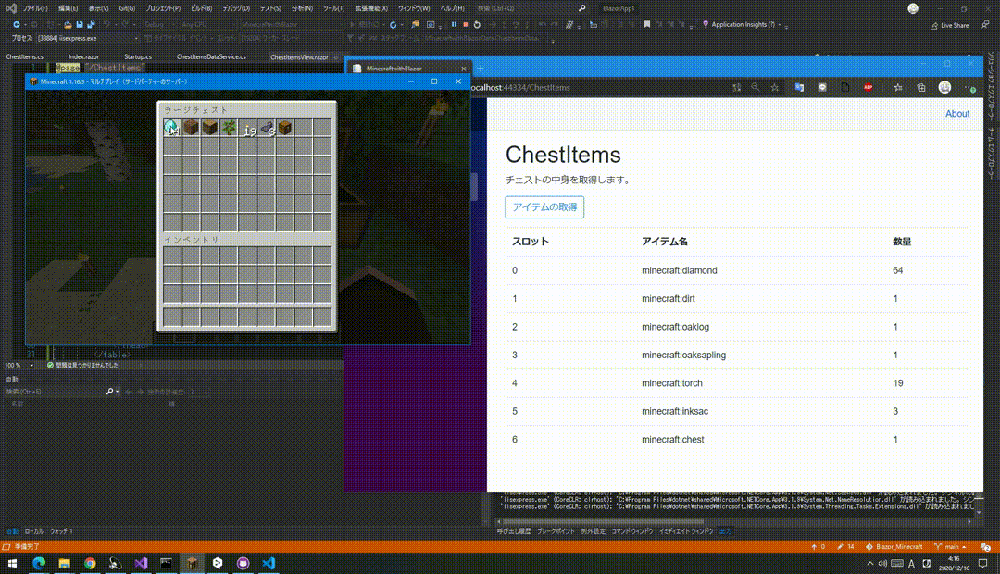

# MCBlazor_GetChestItems
Blazor アプリから Minecraft に設置したチェストの中身（アイテム）を取得するサンプルコードです。

**MinecraftwithBlazor** が本体となっております。アプリを動かす前に、Minecraft 1.13 以上のサーバを起動し、チェストを設置した状態にしてください。そのあと、ソースコード内 (MCBlazor_GetChestItems/MinecraftwithBlazor/Pages/ChestItems/ChestItemsView.razor) のチェストの座標を書きかえて実行してください。

 

詳細はブログをご覧ください。 
https://blog.takunology.jp/entry/2020/12/16/051112

 
---
ConsoleApp1はコンソールアプリ版ですが、これは下書きみたいなものなので削除していただいて結構です。